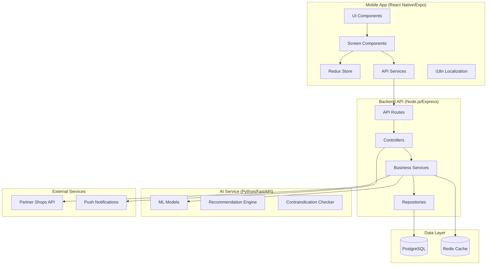
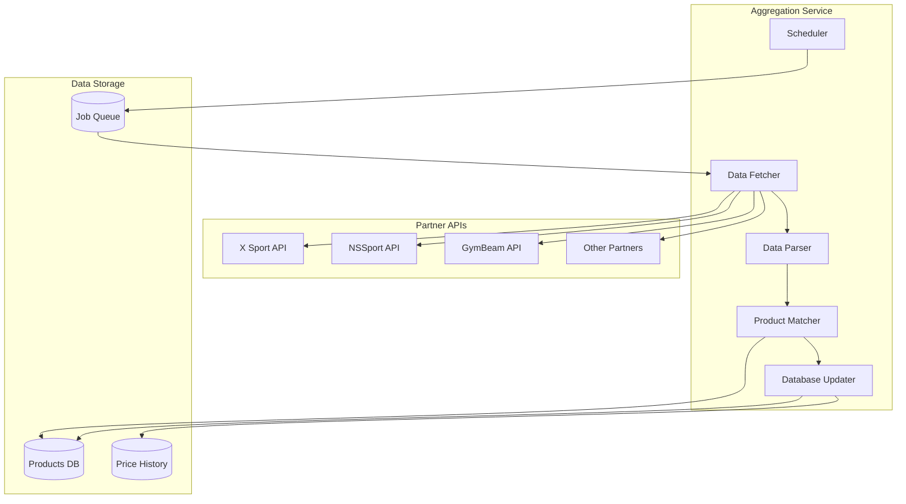
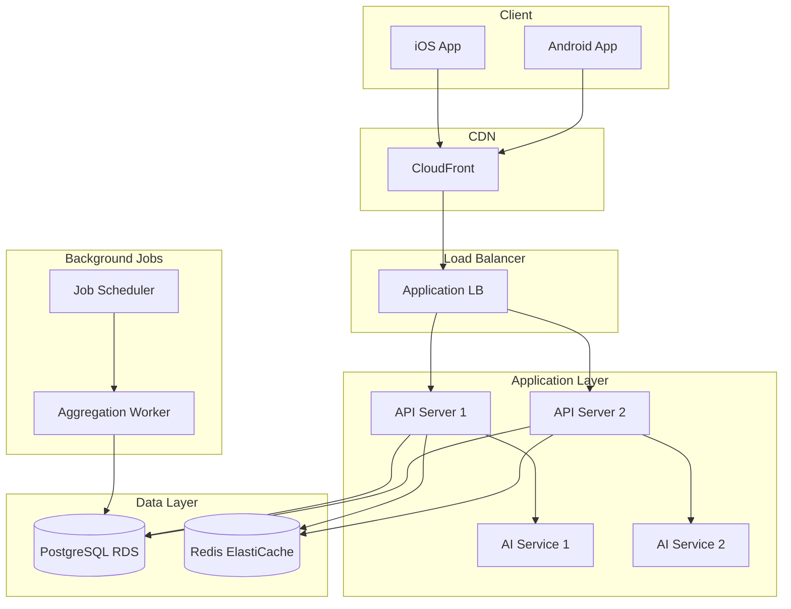

# Design Document: UX/UI, Механика и Агрегация

## Overview

Данный документ описывает архитектуру и дизайн для реализации полноценного UX/UI мобильного приложения "Individual Sports Nutrition", механики пользовательских сценариев и системы агрегации данных о продуктах спортивного питания на сербском рынке.

**Цель:** Создать персонализированное мобильное приложение, которое:
- Подбирает спортивное питание с учётом здоровья, целей и противопоказаний
- Агрегирует данные о продуктах из партнёрских магазинов Сербии
- Обеспечивает удобный UX для пользователей разного уровня подготовки
- Поддерживает 6 языков (sr, hu, ro, en, ru, uk)

**Текущее состояние:**
- ✅ Backend API (Node.js + Express) — готов
- ✅ AI Service (Python + FastAPI) — готов  
- ✅ База данных (PostgreSQL + Redis) — готова
- ✅ 269+ автоматизированных тестов
- ⏳ Mobile App (React Native/Expo) — требует реализации экранов

---

## Architecture

### Общая архитектура системы



### Архитектура мобильного приложения

```
mobile-app/src/
├── components/           # Переиспользуемые UI компоненты
│   ├── ui/              # Базовые UI элементы (Button, Input, Card)
│   ├── forms/           # Формы (HealthProfileForm, LoginForm)
│   ├── cards/           # Карточки (ProductCard, RecommendationCard)
│   ├── charts/          # Графики (ProgressChart, NutritionChart)
│   └── navigation/      # Навигационные компоненты
├── screens/             # Экраны приложения
│   ├── onboarding/      # Онбординг экраны
│   ├── auth/            # Авторизация/Регистрация
│   ├── profile/         # Профиль здоровья
│   ├── recommendations/ # Рекомендации
│   ├── catalog/         # Каталог продуктов
│   ├── progress/        # Трекинг прогресса
│   └── settings/        # Настройки
├── navigation/          # React Navigation конфигурация
├── store/               # Redux store и slices
├── services/            # API сервисы
├── hooks/               # Custom React hooks
├── i18n/                # Локализация
├── types/               # TypeScript типы
└── utils/               # Утилиты
```

---

## Components and Interfaces

### 1. UI Component Library

#### 1.1 Базовые компоненты (ui/)

| Компонент | Описание | Props |
|-----------|----------|-------|
| `Button` | Кнопка с вариантами стилей | `variant: 'primary' \| 'secondary' \| 'outline'`, `size`, `loading`, `disabled` |
| `Input` | Текстовое поле с валидацией | `type`, `error`, `label`, `placeholder` |
| `Card` | Карточка-контейнер | `variant`, `shadow`, `padding` |
| `Badge` | Бейдж/метка | `color`, `text` |
| `Avatar` | Аватар пользователя | `size`, `source`, `fallback` |
| `ProgressBar` | Индикатор прогресса | `value`, `max`, `color` |
| `Skeleton` | Скелетон для загрузки | `width`, `height`, `variant` |
| `Modal` | Модальное окно | `visible`, `onClose`, `title` |
| `Toast` | Уведомление | `type: 'success' \| 'error' \| 'warning'`, `message` |

#### 1.2 Формы (forms/)

```typescript
// HealthProfileForm - пошаговая форма профиля здоровья
interface HealthProfileFormProps {
  initialData?: Partial<HealthProfile>;
  onComplete: (data: HealthProfile) => void;
  onStepChange?: (step: number) => void;
}

// Шаги формы:
// Step 1: BasicInfoStep (пол, возраст, рост, вес)
// Step 2: ActivityStep (уровень активности)
// Step 3: GoalsStep (цели: масса, сушка, поддержание)
// Step 4: HealthStep (заболевания, противопоказания)
// Step 5: MedicationsStep (лекарства)
```

#### 1.3 Карточки (cards/)

```typescript
// ProductCard - карточка продукта в каталоге
interface ProductCardProps {
  product: Product;
  isRecommended?: boolean;
  onPress: () => void;
  onAddToFavorites?: () => void;
}

// RecommendationCard - карточка рекомендации
interface RecommendationCardProps {
  recommendation: Recommendation;
  onPress: () => void;
  onBuy?: () => void;
}

// StoreCard - карточка магазина с ценой
interface StoreCardProps {
  store: Store;
  price: number;
  inStock: boolean;
  onBuy: () => void;
}
```

### 2. Screen Components

#### 2.1 Онбординг (screens/onboarding/)

```typescript
// OnboardingScreen - главный экран онбординга
// Содержит 3-4 слайда с описанием ценности приложения

interface OnboardingSlide {
  id: string;
  title: string;
  description: string;
  image: ImageSource;
}

const slides: OnboardingSlide[] = [
  { id: '1', title: 'onboarding.slide1.title', description: 'onboarding.slide1.desc', image: require('./assets/slide1.png') },
  { id: '2', title: 'onboarding.slide2.title', description: 'onboarding.slide2.desc', image: require('./assets/slide2.png') },
  { id: '3', title: 'onboarding.slide3.title', description: 'onboarding.slide3.desc', image: require('./assets/slide3.png') },
];

// LanguageSelectScreen - выбор языка
interface LanguageOption {
  code: 'sr' | 'hu' | 'ro' | 'en' | 'ru' | 'uk';
  name: string;
  nativeName: string;
  flag: string;
}
```

#### 2.2 Авторизация (screens/auth/)

```typescript
// LoginScreen
// - Email/Password форма
// - Кнопка "Забыл пароль"
// - Ссылка на регистрацию

// RegisterScreen  
// - Email, Password, Confirm Password
// - Индикатор надёжности пароля
// - Валидация в реальном времени

// ForgotPasswordScreen
// - Email для сброса пароля
// - Подтверждение отправки
```

#### 2.3 Профиль здоровья (screens/profile/)

```typescript
// HealthProfileSetupScreen - первичная настройка
// - Wizard с 5 шагами
// - Progress indicator
// - Возможность пропуска необязательных полей

// HealthProfileEditScreen - редактирование профиля
// - Все поля доступны для редактирования
// - Автоматический пересчёт рекомендаций при сохранении
```

#### 2.4 Рекомендации (screens/recommendations/)

```typescript
// RecommendationsScreen - главный экран с рекомендациями
interface RecommendationsScreenState {
  recommendations: Recommendation[];
  loading: boolean;
  lastUpdated: Date;
}

// RecommendationDetailScreen - детали рекомендации
// - Полная информация о добавке
// - Дозировка и время приёма
// - Объяснение "почему рекомендовано"
// - Противопоказания
// - Список магазинов с ценами
```

#### 2.5 Каталог (screens/catalog/)

```typescript
// CatalogScreen - каталог продуктов
interface CatalogFilters {
  type?: ProductType[];
  brand?: string[];
  priceRange?: { min: number; max: number };
  inStock?: boolean;
  recommended?: boolean;
}

// ProductDetailScreen - детали продукта
// - Полный состав и макросы
// - Описание
// - Список магазинов с ценами (сортировка по цене)
// - Кнопка "Купить" (deep link)
// - Кнопка "В избранное"

// SearchScreen - поиск продуктов
// - Поиск по названию, бренду, типу
// - История поиска
// - Подсказки
```

#### 2.6 Прогресс (screens/progress/)

```typescript
// ProgressScreen - трекинг прогресса
// - График изменения веса
// - Список записей
// - Тренд и прогноз

// AddProgressScreen - добавление записи
interface ProgressEntry {
  date: Date;
  weight: number;
  bodyFat?: number;
  notes?: string;
}
```

### 3. Navigation Structure

```typescript
// Структура навигации
const Navigation = () => (
  <NavigationContainer>
    <Stack.Navigator>
      {/* Онбординг (показывается только при первом запуске) */}
      <Stack.Screen name="Onboarding" component={OnboardingNavigator} />
      
      {/* Авторизация */}
      <Stack.Screen name="Auth" component={AuthNavigator} />
      
      {/* Основное приложение */}
      <Stack.Screen name="Main" component={MainTabNavigator} />
    </Stack.Navigator>
  </NavigationContainer>
);

// MainTabNavigator - нижняя навигация
const MainTabNavigator = () => (
  <Tab.Navigator>
    <Tab.Screen name="Home" component={RecommendationsScreen} />
    <Tab.Screen name="Catalog" component={CatalogNavigator} />
    <Tab.Screen name="Progress" component={ProgressNavigator} />
    <Tab.Screen name="Profile" component={ProfileNavigator} />
  </Tab.Navigator>
);
```

---

## Data Models

### 1. User & Authentication

```typescript
interface User {
  id: string;
  email: string;
  preferredLanguage: Language;
  createdAt: Date;
  updatedAt: Date;
  onboardingCompleted: boolean;
  healthProfileCompleted: boolean;
}

type Language = 'sr' | 'hu' | 'ro' | 'en' | 'ru' | 'uk';

interface AuthState {
  user: User | null;
  token: string | null;
  refreshToken: string | null;
  isAuthenticated: boolean;
  isLoading: boolean;
}
```

### 2. Health Profile

```typescript
interface HealthProfile {
  id: string;
  userId: string;
  
  // Базовые данные
  gender: 'male' | 'female' | 'other';
  age: number;
  height: number; // см
  weight: number; // кг
  
  // Активность
  activityLevel: ActivityLevel;
  
  // Цели
  goal: FitnessGoal;
  
  // Здоровье
  diseases: Disease[];
  allergies: string[];
  
  // Лекарства
  medications: Medication[];
  
  createdAt: Date;
  updatedAt: Date;
}

type ActivityLevel = 'sedentary' | 'light' | 'moderate' | 'high' | 'very_high';
type FitnessGoal = 'mass_gain' | 'fat_loss' | 'maintenance' | 'endurance';

interface Disease {
  id: string;
  nameKey: string; // ключ для перевода
  severity?: 'mild' | 'moderate' | 'severe';
}

interface Medication {
  id: string;
  name: string;
  dosage?: string;
  frequency?: string;
}
```

### 3. Products & Catalog

```typescript
interface Product {
  id: string;
  nameKey: string; // ключ для перевода
  brandId: string;
  brand: Brand;
  type: ProductType;
  
  // Состав
  macros: Macros;
  ingredients: Ingredient[];
  
  // Цены в магазинах
  storeProducts: StoreProduct[];
  
  // Метаданные
  imageUrl?: string;
  rating?: number;
  reviewCount?: number;
  
  // Флаги
  isRecommended?: boolean; // для текущего пользователя
  hasContraindication?: boolean;
  
  createdAt: Date;
  updatedAt: Date;
}

type ProductType = 
  | 'protein' 
  | 'creatine' 
  | 'amino_acids' 
  | 'pre_workout' 
  | 'vitamins' 
  | 'minerals' 
  | 'fat_burner' 
  | 'mass_gainer'
  | 'other';

interface Macros {
  calories: number;
  protein: number;
  carbs: number;
  fats: number;
  fiber?: number;
}

interface Brand {
  id: string;
  name: string;
  originCountry: string;
  verified: boolean;
  logoUrl?: string;
}

interface StoreProduct {
  storeId: string;
  store: Store;
  price: number;
  currency: string;
  inStock: boolean;
  url: string; // deep link или веб-ссылка
  lastUpdated: Date;
}

interface Store {
  id: string;
  name: string;
  logoUrl?: string;
  websiteUrl: string;
  isPartner: boolean;
}
```

### 4. Recommendations

```typescript
interface Recommendation {
  id: string;
  userId: string;
  productId: string;
  product: Product;
  
  // Рекомендация
  dosage: string;
  timing: string; // "утром", "до тренировки", etc.
  reason: string; // объяснение "почему"
  reasonKey: string; // ключ для перевода
  
  // Приоритет
  priority: 'essential' | 'recommended' | 'optional';
  
  // Предупреждения
  warnings?: Warning[];
  
  createdAt: Date;
}

interface Warning {
  type: 'contraindication' | 'interaction' | 'dosage';
  message: string;
  messageKey: string;
  severity: 'low' | 'medium' | 'high';
}
```

### 5. Progress Tracking

```typescript
interface ProgressEntry {
  id: string;
  userId: string;
  date: Date;
  
  // Измерения
  weight: number;
  bodyFat?: number;
  
  // Дополнительные параметры
  measurements?: BodyMeasurements;
  
  // Заметки
  notes?: string;
  
  createdAt: Date;
}

interface BodyMeasurements {
  chest?: number;
  waist?: number;
  hips?: number;
  biceps?: number;
  thighs?: number;
}

interface ProgressAnalysis {
  trend: 'gaining' | 'losing' | 'maintaining';
  weeklyChange: number;
  projectedGoalDate?: Date;
  recommendations?: string[];
}
```

### 6. Notifications

```typescript
interface NotificationSettings {
  userId: string;
  
  // Типы уведомлений
  supplementReminders: boolean;
  priceAlerts: boolean;
  newProducts: boolean;
  progressReminders: boolean;
  
  // Расписание напоминаний о добавках
  supplementSchedule: SupplementReminder[];
}

interface SupplementReminder {
  productId: string;
  time: string; // "08:00"
  days: DayOfWeek[];
  enabled: boolean;
}

type DayOfWeek = 'mon' | 'tue' | 'wed' | 'thu' | 'fri' | 'sat' | 'sun';
```

---

## Error Handling

### 1. API Error Handling

```typescript
// Стандартная структура ошибки API
interface ApiError {
  code: string;
  message: string;
  messageKey: string; // для локализации
  details?: Record<string, any>;
}

// Коды ошибок
enum ErrorCode {
  // Аутентификация
  INVALID_CREDENTIALS = 'AUTH_001',
  TOKEN_EXPIRED = 'AUTH_002',
  EMAIL_ALREADY_EXISTS = 'AUTH_003',
  
  // Валидация
  VALIDATION_ERROR = 'VAL_001',
  INVALID_EMAIL = 'VAL_002',
  WEAK_PASSWORD = 'VAL_003',
  
  // Профиль
  PROFILE_NOT_FOUND = 'PROFILE_001',
  PROFILE_INCOMPLETE = 'PROFILE_002',
  
  // Продукты
  PRODUCT_NOT_FOUND = 'PRODUCT_001',
  STORE_UNAVAILABLE = 'PRODUCT_002',
  
  // Сеть
  NETWORK_ERROR = 'NET_001',
  TIMEOUT = 'NET_002',
  SERVER_ERROR = 'NET_003',
}
```

### 2. UI Error States

```typescript
// Компонент для отображения ошибок
interface ErrorStateProps {
  error: ApiError;
  onRetry?: () => void;
  showRetry?: boolean;
}

// Примеры состояний:
// - Нет сети → показать офлайн-экран с кнопкой "Повторить"
// - Ошибка сервера → показать сообщение с кнопкой "Повторить"
// - Ошибка валидации → показать inline ошибку у поля
// - Не найдено → показать пустое состояние
```

### 3. Offline Support

```typescript
// Стратегия работы офлайн
interface OfflineStrategy {
  // Кэшируемые данные
  cachedData: {
    healthProfile: boolean;
    recommendations: boolean;
    favorites: boolean;
    progressHistory: boolean;
  };
  
  // Очередь действий для синхронизации
  pendingActions: PendingAction[];
}

interface PendingAction {
  id: string;
  type: 'add_progress' | 'update_profile' | 'add_favorite';
  payload: any;
  createdAt: Date;
}
```

---

## Testing Strategy

### 1. Unit Tests

```typescript
// Тестирование компонентов
describe('ProductCard', () => {
  it('should render product name and price', () => {});
  it('should show recommended badge when isRecommended is true', () => {});
  it('should call onPress when card is tapped', () => {});
  it('should call onAddToFavorites when heart icon is tapped', () => {});
});

// Тестирование хуков
describe('useHealthProfile', () => {
  it('should fetch profile on mount', () => {});
  it('should update profile and trigger recommendations recalculation', () => {});
  it('should handle errors gracefully', () => {});
});

// Тестирование сервисов
describe('RecommendationService', () => {
  it('should fetch recommendations for user', () => {});
  it('should filter out contraindicated products', () => {});
  it('should sort by priority', () => {});
});
```

### 2. Integration Tests

```typescript
// Тестирование user flows
describe('Health Profile Setup Flow', () => {
  it('should complete all 5 steps', () => {});
  it('should save profile and navigate to recommendations', () => {});
  it('should allow skipping optional fields', () => {});
});

describe('Product Purchase Flow', () => {
  it('should show stores sorted by price', () => {});
  it('should open store link when Buy is pressed', () => {});
  it('should add to favorites', () => {});
});
```

### 3. E2E Tests

```typescript
// Playwright/Detox тесты
describe('Complete User Journey', () => {
  it('should complete onboarding', () => {});
  it('should register new user', () => {});
  it('should setup health profile', () => {});
  it('should view recommendations', () => {});
  it('should search and view product', () => {});
  it('should track progress', () => {});
});
```

---


## Aggregation System Design

### 1. Архитектура системы агрегации



### 2. Интеграция с партнёрскими магазинами

```typescript
// Интерфейс для партнёрского магазина
interface PartnerIntegration {
  id: string;
  name: string;
  type: 'api' | 'scraper' | 'feed';
  
  // Конфигурация
  config: {
    baseUrl: string;
    apiKey?: string;
    rateLimit: number; // запросов в минуту
    updateInterval: number; // часы между обновлениями
  };
  
  // Статус
  status: 'active' | 'inactive' | 'error';
  lastSync: Date;
  lastError?: string;
}

// Стандартизированный формат данных от партнёра
interface PartnerProductData {
  externalId: string;
  name: string;
  brand: string;
  price: number;
  currency: string;
  inStock: boolean;
  url: string;
  imageUrl?: string;
  
  // Опциональные данные
  sku?: string;
  ean?: string;
  description?: string;
  category?: string;
}
```

### 3. Процесс агрегации

```typescript
// Шаг 1: Получение данных
async function fetchPartnerData(partner: PartnerIntegration): Promise<PartnerProductData[]> {
  switch (partner.type) {
    case 'api':
      return fetchFromApi(partner);
    case 'feed':
      return fetchFromFeed(partner);
    case 'scraper':
      return fetchViaScraper(partner);
  }
}

// Шаг 2: Сопоставление с существующими продуктами
interface ProductMatch {
  partnerProduct: PartnerProductData;
  matchedProduct?: Product;
  matchConfidence: number; // 0-1
  matchMethod: 'sku' | 'ean' | 'name_brand' | 'fuzzy';
}

async function matchProducts(
  partnerProducts: PartnerProductData[]
): Promise<ProductMatch[]> {
  // 1. Точное совпадение по SKU/EAN
  // 2. Совпадение по названию + бренду
  // 3. Fuzzy matching для остальных
  // 4. Новые продукты → флаг "требует модерации"
}

// Шаг 3: Обновление базы данных
async function updateDatabase(matches: ProductMatch[]): Promise<void> {
  for (const match of matches) {
    if (match.matchedProduct) {
      // Обновить цену и наличие
      await updateStoreProduct(match);
      // Сохранить историю цен
      await savePriceHistory(match);
    } else if (match.matchConfidence > 0.8) {
      // Создать новый продукт с флагом модерации
      await createPendingProduct(match);
    }
  }
}
```

### 4. Мониторинг и алерты

```typescript
interface AggregationMetrics {
  partnerId: string;
  timestamp: Date;
  
  // Метрики
  productsProcessed: number;
  productsMatched: number;
  productsNew: number;
  pricesUpdated: number;
  errors: number;
  
  // Время выполнения
  durationMs: number;
}

// Алерты для администратора
interface AggregationAlert {
  type: 'error' | 'warning' | 'info';
  partnerId: string;
  message: string;
  timestamp: Date;
}

// Примеры алертов:
// - Партнёр недоступен более 24 часов
// - Резкое изменение количества продуктов (>20%)
// - Много несопоставленных продуктов
// - Ошибки парсинга данных
```

---

## Admin Panel Design

### 1. Структура админ-панели

```
admin-panel/
├── pages/
│   ├── dashboard/        # Главная с метриками
│   ├── products/         # Управление продуктами
│   ├── brands/           # Управление брендами
│   ├── stores/           # Управление магазинами
│   ├── contraindications/# Противопоказания
│   ├── translations/     # Переводы
│   ├── users/            # Пользователи (read-only)
│   └── aggregation/      # Мониторинг агрегации
├── components/
│   ├── DataTable/        # Таблица с фильтрами и пагинацией
│   ├── Forms/            # Формы редактирования
│   └── Charts/           # Графики и метрики
└── services/
    └── admin-api.ts      # API для админки
```

### 2. Dashboard метрики

```typescript
interface DashboardMetrics {
  // Пользователи
  totalUsers: number;
  activeUsers: number; // за последние 30 дней
  newUsersToday: number;
  
  // Продукты
  totalProducts: number;
  pendingModeration: number;
  
  // Магазины
  activeStores: number;
  lastAggregationTime: Date;
  aggregationErrors: number;
  
  // Рекомендации
  recommendationsGenerated: number;
  averageRecommendationsPerUser: number;
}
```

### 3. Управление продуктами

```typescript
// Список продуктов с фильтрами
interface ProductListFilters {
  search?: string;
  type?: ProductType[];
  brand?: string[];
  status?: 'active' | 'pending' | 'inactive';
  hasTranslation?: Language[];
}

// Форма редактирования продукта
interface ProductEditForm {
  // Основные данные
  type: ProductType;
  brandId: string;
  
  // Переводы названия
  translations: {
    [key in Language]?: string;
  };
  
  // Состав
  macros: Macros;
  ingredients: string[];
  
  // Противопоказания
  contraindicationIds: string[];
  
  // Статус
  status: 'active' | 'pending' | 'inactive';
}
```

### 4. Управление переводами

```typescript
// Интерфейс для управления переводами
interface TranslationManager {
  // Получить все ключи без перевода для языка
  getMissingTranslations(language: Language): TranslationKey[];
  
  // Массовое обновление переводов
  bulkUpdateTranslations(translations: Translation[]): Promise<void>;
  
  // Экспорт/импорт для переводчиков
  exportForTranslation(language: Language): TranslationExport;
  importTranslations(data: TranslationExport): Promise<void>;
}

interface TranslationExport {
  language: Language;
  keys: {
    key: string;
    sourceText: string; // английский текст
    currentTranslation?: string;
  }[];
}
```

---

## Localization Strategy

### 1. Структура локализации

```typescript
// i18n/locales/
// ├── sr.json  (сербский - основной)
// ├── hu.json  (венгерский)
// ├── ro.json  (румынский)
// ├── en.json  (английский)
// ├── ru.json  (русский)
// └── uk.json  (украинский)

// Структура файла локализации
interface LocaleFile {
  // Общие
  common: {
    save: string;
    cancel: string;
    next: string;
    back: string;
    loading: string;
    error: string;
    retry: string;
  };
  
  // Онбординг
  onboarding: {
    slide1: { title: string; desc: string };
    slide2: { title: string; desc: string };
    slide3: { title: string; desc: string };
    selectLanguage: string;
  };
  
  // Авторизация
  auth: {
    login: string;
    register: string;
    email: string;
    password: string;
    confirmPassword: string;
    forgotPassword: string;
    // ...
  };
  
  // Профиль здоровья
  healthProfile: {
    title: string;
    steps: {
      basic: string;
      activity: string;
      goals: string;
      health: string;
      medications: string;
    };
    // ...
  };
  
  // И т.д. для всех разделов
}
```

### 2. Динамический контент

```typescript
// Переводы из базы данных (названия продуктов, описания)
interface DatabaseTranslation {
  key: string;
  language: Language;
  text: string;
}

// Хук для получения перевода
function useTranslatedText(key: string): string {
  const { language } = useLanguage();
  const { data } = useQuery(['translation', key, language], () => 
    translationService.getTranslation(key, language)
  );
  return data?.text || key;
}
```

### 3. Сербская специфика

```typescript
// Адаптация под сербскую кухню
interface SerbianCuisineAdapter {
  // Популярные блюда для рекомендаций
  popularDishes: {
    id: string;
    nameKey: string;
    macros: Macros;
    category: 'breakfast' | 'lunch' | 'dinner' | 'snack';
  }[];
  
  // Локальные бренды
  localBrands: string[];
  
  // Предпочтения по умолчанию
  defaultPreferences: {
    meatBased: boolean;
    dairyIncluded: boolean;
    localProductsPreferred: boolean;
  };
}
```

---

## Performance Considerations

### 1. Оптимизация загрузки

```typescript
// Lazy loading экранов
const CatalogScreen = lazy(() => import('./screens/catalog/CatalogScreen'));
const ProgressScreen = lazy(() => import('./screens/progress/ProgressScreen'));

// Оптимизация изображений
interface ImageOptimization {
  // Использовать WebP формат
  format: 'webp';
  
  // Размеры для разных контекстов
  sizes: {
    thumbnail: { width: 100, height: 100 };
    card: { width: 200, height: 200 };
    detail: { width: 400, height: 400 };
  };
  
  // Placeholder во время загрузки
  placeholder: 'blur' | 'skeleton';
}
```

### 2. Кэширование

```typescript
// Стратегия кэширования
interface CacheStrategy {
  // React Query настройки
  queryDefaults: {
    staleTime: 5 * 60 * 1000; // 5 минут
    cacheTime: 30 * 60 * 1000; // 30 минут
  };
  
  // Персистентный кэш
  persistedQueries: [
    'healthProfile',
    'recommendations',
    'favorites',
    'progressHistory'
  ];
  
  // Инвалидация кэша
  invalidationRules: {
    onProfileUpdate: ['recommendations'];
    onProgressAdd: ['progressHistory', 'progressAnalysis'];
  };
}
```

### 3. Оптимизация списков

```typescript
// Виртуализация длинных списков
import { FlashList } from '@shopify/flash-list';

// Для каталога продуктов
<FlashList
  data={products}
  renderItem={({ item }) => <ProductCard product={item} />}
  estimatedItemSize={120}
  keyExtractor={(item) => item.id}
/>

// Пагинация
interface PaginatedResponse<T> {
  items: T[];
  total: number;
  page: number;
  pageSize: number;
  hasMore: boolean;
}
```

---

## Security Considerations

### 1. Аутентификация

```typescript
// JWT токены
interface TokenStrategy {
  accessToken: {
    expiresIn: '15m';
    storage: 'memory'; // не хранить в AsyncStorage
  };
  refreshToken: {
    expiresIn: '7d';
    storage: 'secureStorage'; // Keychain/Keystore
  };
}

// Автоматическое обновление токена
async function refreshAccessToken(): Promise<string> {
  const refreshToken = await SecureStore.getItemAsync('refreshToken');
  const response = await api.post('/auth/refresh', { refreshToken });
  return response.data.accessToken;
}
```

### 2. Защита данных

```typescript
// Шифрование чувствительных данных
interface DataProtection {
  // Данные здоровья шифруются перед отправкой
  encryptHealthData: boolean;
  
  // Локальное хранение
  secureStorage: {
    tokens: true;
    healthProfile: true;
    medications: true;
  };
  
  // Очистка при выходе
  clearOnLogout: [
    'healthProfile',
    'recommendations',
    'progressHistory'
  ];
}
```

### 3. Валидация

```typescript
// Валидация на клиенте и сервере
const healthProfileSchema = z.object({
  gender: z.enum(['male', 'female', 'other']),
  age: z.number().min(14).max(120),
  height: z.number().min(100).max(250),
  weight: z.number().min(30).max(300),
  activityLevel: z.enum(['sedentary', 'light', 'moderate', 'high', 'very_high']),
  goal: z.enum(['mass_gain', 'fat_loss', 'maintenance', 'endurance']),
  diseases: z.array(z.string()).optional(),
  medications: z.array(z.string()).optional(),
});
```

---

## Deployment Architecture

### 1. Инфраструктура



### 2. CI/CD Pipeline

```yaml
# .github/workflows/mobile-deploy.yml
name: Mobile App Deploy

on:
  push:
    branches: [main]
    paths:
      - 'mobile-app/**'

jobs:
  test:
    runs-on: ubuntu-latest
    steps:
      - uses: actions/checkout@v3
      - name: Install dependencies
        run: npm ci
      - name: Run tests
        run: npm test
      - name: Run E2E tests
        run: npm run test:e2e

  build-ios:
    needs: test
    runs-on: macos-latest
    steps:
      - name: Build iOS
        run: eas build --platform ios

  build-android:
    needs: test
    runs-on: ubuntu-latest
    steps:
      - name: Build Android
        run: eas build --platform android

  deploy:
    needs: [build-ios, build-android]
    steps:
      - name: Submit to stores
        run: eas submit
```

---

## Appendix: Screen Wireframes

### A. Онбординг Flow

```
┌─────────────────────┐    ┌─────────────────────┐    ┌─────────────────────┐
│                     │    │                     │    │                     │
│   [Illustration]    │    │   [Illustration]    │    │   [Illustration]    │
│                     │    │                     │    │                     │
│  Персонализация     │    │  Безопасность       │    │  Локальные бренды   │
│  под ваши цели      │    │  и здоровье         │    │  и магазины         │
│                     │    │                     │    │                     │
│  ○ ● ○              │    │  ○ ○ ●              │    │  ○ ○ ○              │
│                     │    │                     │    │                     │
│  [Далее]            │    │  [Далее]            │    │  [Начать]           │
└─────────────────────┘    └─────────────────────┘    └─────────────────────┘
```

### B. Главный экран (Рекомендации)

```
┌─────────────────────┐
│ ☰  Рекомендации  ⚙️ │
├─────────────────────┤
│                     │
│ Привет, Марко! 👋   │
│ Ваш план на сегодня │
│                     │
├─────────────────────┤
│ ┌─────────────────┐ │
│ │ 🥤 Протеин      │ │
│ │ 30г утром       │ │
│ │ [Подробнее]     │ │
│ └─────────────────┘ │
│ ┌─────────────────┐ │
│ │ 💊 Креатин      │ │
│ │ 5г после трен.  │ │
│ │ [Подробнее]     │ │
│ └─────────────────┘ │
│ ┌─────────────────┐ │
│ │ 🧪 BCAA         │ │
│ │ 10г до трен.    │ │
│ │ [Подробнее]     │ │
│ └─────────────────┘ │
│                     │
├─────────────────────┤
│ 🏠  📦  📈  👤     │
└─────────────────────┘
```

### C. Детали продукта

```
┌─────────────────────┐
│ ←  Whey Protein     │
├─────────────────────┤
│                     │
│   [Product Image]   │
│                     │
│ Optimum Nutrition   │
│ Gold Standard Whey  │
│ ⭐ 4.8 (234 отзыва) │
│                     │
│ ✅ Рекомендовано    │
│    для вас          │
├─────────────────────┤
│ Состав на порцию:   │
│ Белок: 24г          │
│ Углеводы: 3г        │
│ Жиры: 1г            │
│ Калории: 120        │
├─────────────────────┤
│ Цены в магазинах:   │
│ ┌─────────────────┐ │
│ │ X Sport  3490 RSD│ │
│ │ В наличии [Купить]│
│ └─────────────────┘ │
│ ┌─────────────────┐ │
│ │ NSSport  3690 RSD│ │
│ │ В наличии [Купить]│
│ └─────────────────┘ │
│                     │
│ [♡ В избранное]     │
└─────────────────────┘
```
